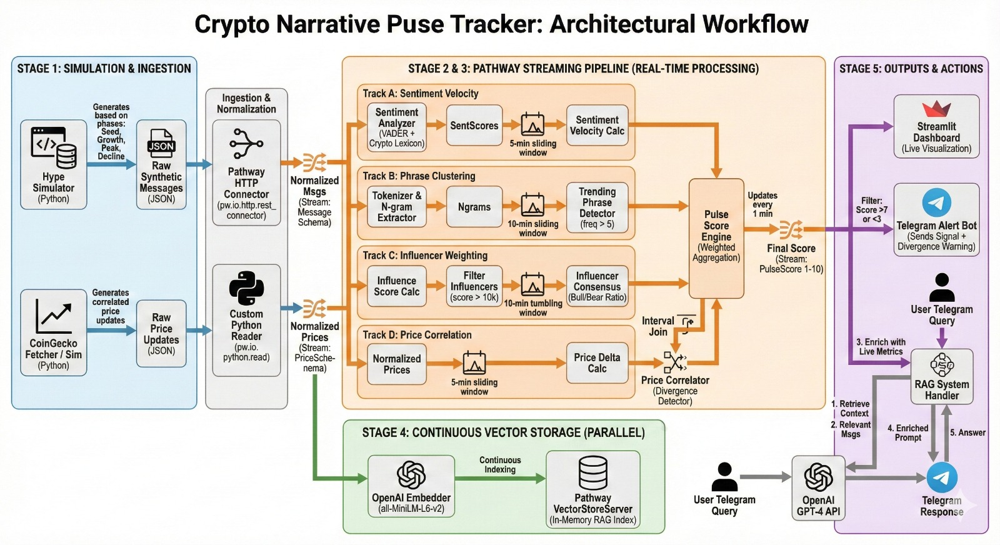

# Crypto Narrative Pulse Tracker

Real-time sentiment analytics for crypto traders. Processes social signals → generates momentum scores (1-10) → sends alerts.



## Features

- **Pulse Score** - Combines sentiment, trending phrases, influencer signals into 1-10 score
- **Phrase Clustering** - Detects emerging narratives via bigram/trigram analysis
- **Influencer Tracking** - Weights signals by follower count and engagement
- **Divergence Detection** - Alerts when sentiment diverges from price action
- **RAG Chat** - Query market context with LLM-powered responses
- **Telegram Alerts** - Real-time notifications for score thresholds

## Quick Start

### Docker (Recommended)

```bash
# Start pipeline
docker-compose up pipeline

# With simulator (demo mode)
docker-compose --profile demo up
```

### Local Development (Windows)

```bash
# Pathway requires Linux - use demo mode locally
.venv_demo\Scripts\activate
python main.py
```

### Frontend

```bash
cd frontend
npm install
npm run dev
```

## API Endpoints

| Endpoint | Method | Description |
|----------|--------|-------------|
| `/api/metrics` | GET | Current pulse score, phrases, consensus |
| `/api/metrics/history` | GET | Historical scores for charting |
| `/api/performance` | GET | Latency and throughput metrics |
| `/api/query` | POST | RAG query for market insights |
| `/` | POST | Webhook for message ingestion |

## Configuration

```bash
# .env
TELEGRAM_TOKEN=your_bot_token
TELEGRAM_CHANNEL_ID=@your_channel
TRACKED_COIN=MEME
COINGECKO_API_KEY=CG-xxx  # Optional, demo key
```

## Project Structure

```
├── main.py              # API server + demo mode
├── pipeline.py          # Pathway streaming pipeline
├── transforms/          # Sentiment, pulse score, clustering
├── connectors/          # Webhook, price fetcher
├── bot/                 # Telegram alerts
├── rag/                 # LLM integration
├── simulator/           # Hype cycle simulator
└── frontend/            # Next.js dashboard
```

## Tech Stack

- **Pathway** - Real-time streaming (Docker only)
- **VADER + Crypto Lexicon** - Sentiment analysis
- **CoinGecko API** - Price data
- **Ollama** - Local LLM for RAG
- **Next.js** - Dashboard frontend
- **Telegram Bot API** - Alerts

## Tests

```bash
python -m pytest tests/ -v
```

153 tests covering core pipeline, sentiment, pulse score, phrase clustering, influencer tracking, and performance monitoring.
